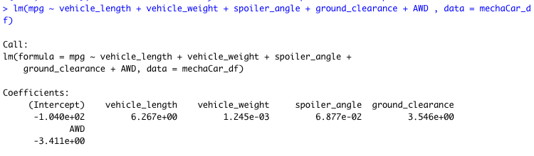
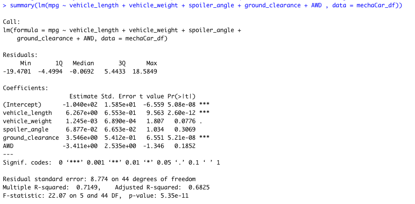
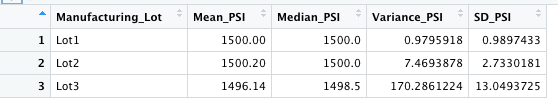
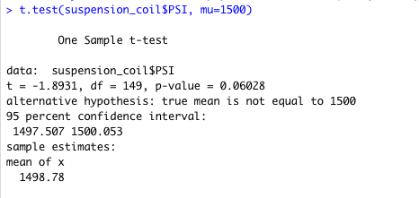
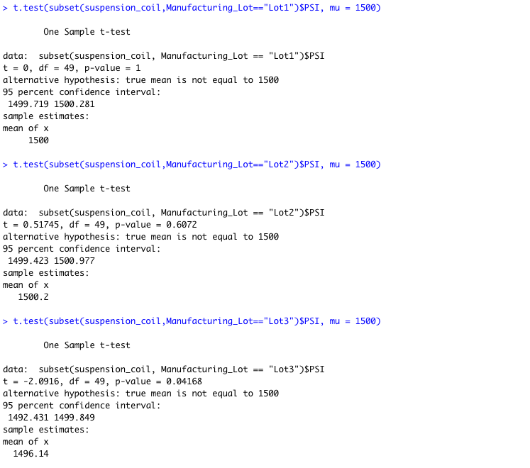

# MechaCar_Statistical_Analysis

# Purpose 
AutosRUs’ newest prototype, the MechaCar, is suffering from production troubles that are blocking the manufacturing team’s progress. AutosRUs’ upper management has called on the data analytics team to review the production data for insights that may help the manufacturing team.

In this challenge, we will help the data analytics team do the following:

- Perform multiple linear regression analysis to identify which variables in the dataset predict the mpg of MechaCar prototypes
- Collect summary statistics on the pounds per square inch (PSI) of the suspension coils from the manufacturing lots
- Run t-tests to determine if the manufacturing lots are statistically different from the mean population
- Design a statistical study to compare vehicle performance of the MechaCar vehicles against vehicles from other manufacturers. 

This new assignment consists of three technical analysis deliverables and a proposal for further statistical study.
 
- Deliverable 1: Linear Regression to Predict MPG
- Deliverable 2: Summary Statistics on Suspension Coils
- Deliverable 3: T-Test on Suspension Coils
- Deliverable 4: Design a Study Comparing the MechaCar to the Competition

# Results
## Deliverable 1:
## Linear Regression to Predict MPG

### Which variables/coefficients provided a non-random amount of variance to the mpg values in the dataset?

In the summary output, each Pr(>|t|) value represents the probability that each coefficient contributes a random amount of variance to the linear model. According to our results, ***vehicle length and ground clearance (as well as intercept)*** are statistically unlikely to provide random amounts of variance to the linear model. In other words the vehicle length and ground clearance have a significant impact on MPG. When an intercept is statistically significant, it means that the intercept term explains a significant amount of variability in the dependent variable when all independent vairables are equal to zero. Depending on our dataset, a significant intercept could mean that the significant features (such as vehicle length and ground clearance) may need scaling or transforming to help improve the predictive power of the model. Alternatively, it may mean that there are other variables that can help explain the variability of our dependent variable that have not been included in our model. 

### Is the slope of the linear model considered to be zero? Why or why not?

The p-value of our linear regression analysis is 5.35e-11, which is very small than generally assumed significance level of 0.05. Therefore, we can state that there is sufficient evidence to reject our null hypothesis, which means that the slope of our linear model is not zero.

### Does this linear model predict mpg of MechaCar prototypes effectively? Why or why not?
Yes, this linear model is considered to predict mpg of MechaCar prototypes effectively. The Multiple R-squared value is 0.7149. This implies that roughly 71% of the variablilty of our dependent variable (MPG) is explained using this linear model.  

## Deliverable 2:
## Summary Statistics on Suspension Coils

### The design specifications for the MechaCar suspension coils dictate that the variance of the suspension coils must not exceed 100 pounds per square inch. 
### Does the current manufacturing data meet this design specification for all manufacturing lots in total and each lot individually? 

### Part 1) ***All*** manufacturing lots:

The total summary data shows us the following statistics: 

-   Mean suspension coil PSI = 1498.78 
-   Median suspension coil PSI = 1500 
-   Variance suspension coil PSI = 62.29356 
-   Standard deviation suspension coil PSI = 7.892627. 

The mean and median are nearly same, which suggests that the dataset is very much a normal distribution.

From the above metrics, the variance is around 62 pounds per inch which is below the specified value. Therefore we can conclude that this current manufacturing data meets the design specification for all manufacturing lots in total.

### Part 2) If looking at ***each*** manufacturing lots individually:
If we are break down each lot and analyze their variance PSI individually, it shows that:

- Variance PSI for lot 1 = 0.9795918
- Variance PSI for lot 2 = 7.4693878
- Variance PSI for lot 3 = 170.2861224

From the above metrics, only lot 1 and lot 2 meet the design specification where variance of suspension coil is below 100 pounds per square inch; lot 3 on the other hand does not meet the design specification because is greater than 100 pounds per square inch.

## Deliverable 3:
## T-Tests on Suspension Coils

### Part 1) Performing t-tests to o determine if ***all*** manufacturing lots are statistically different from the population mean of 1,500 pounds per square inch.

Assuming our significance level was the common 0.05, our p-value is 0.06028 which is above our significance level. Therefore, we do not have sufficient evidence to reject the null hypothesis, and we would state that the two means are statistically similar.

### Part 2) Performing t-tests to determine if ***each lot individually*** are statistically different from the population mean of 1,500 pounds per square inch.

Lot 1: p-Value is 1. This clearly suggests that we do not have sufficient evidence to reject the null hypothesis, and the observed sample mean is not statistically different from the population mean of 1,500 pounds per square inch.

Lot 2: p-Value is 0.6072, which is still much higher than assumed significance level of 0.05. Again, we do not have sufficient evidence to reject the null hypothesis, and the observed sample mean is not statistically different from the population mean of 1,500 pounds per square inch.

Lot 3: p-Value is 0.04, which is lower than the generally assumed significance level of 0.05. Therefore, we can state that there is evidence to reject our null hypothesis, and the sample mean is statistically different from the population mean of 1,500 pounds per square inch.

## Deliverable 4:
## Study Design: MechaCar vs Competition

### What metric are you going to test?
We are interested in designing a statistical analysis to compare the MechaCar highway fuel efficiency against competition. 

### What is the null hypothesis or alternative hypothesis?
H0 : There is no statistical difference between MechaCar and competition.
Ha : There is a statistical difference between MechaCar and competition.
The significance level or p-Value will be set to 0.05.

### What statistical test would you use to test the hypothesis? 

We will perform a two-sample t-Test for this study. This statitiscal test is chosen because it is optimal for numerical and continuous data and it is used to determine if the means of two samples are statistically different.

### What data is needed to run the statistical test?
We need to gather highway fuel efficiency data on MechaCar and their competitors. From the numerical data we will then analyze and compare mean highway fuel efficiency between MecharCar and their competition.
